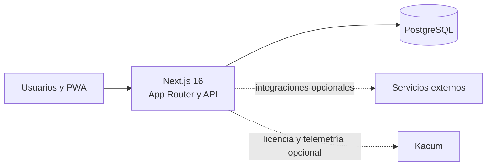

# Comunidad Conecta

Plataforma web multi-comunidad para la gestión integral de comunidades de propietarios. La comunidad conserva la titularidad de su cuenta, sus datos y su historial, mientras que cada administrador trabaja mediante permisos y mandatos revocables.

Comunidad Conecta forma parte del ecosistema de productos de **Kacum** y está diseñada para poder instalarse en infraestructura propia, mantener los datos bajo control de la comunidad y seguir funcionando sin depender de un proveedor SaaS concreto.

La aplicación reúne gestión económica, contabilidad, gobierno, operaciones, documentación, privacidad y servicios digitales en una PWA responsive construida con Next.js y PostgreSQL.

## Principios del proyecto

- **La comunidad conserva sus datos.** La base de datos y los documentos pertenecen a la instalación, no al administrador de fincas ni a Kacum.
- **El cambio de administrador no rompe la continuidad.** Permisos, mandatos y procesos de transición permiten sustituir al gestor sin perder el historial.
- **La transparencia debe ser comprensible.** El objetivo no es acumular PDFs, sino relacionar decisiones, gastos, documentos, incidencias, acuerdos y evidencias.
- **El propietario está en el centro.** La experiencia móvil, los permisos por vivienda y los flujos guiados priorizan el uso cotidiano por personas no técnicas.
- **Las integraciones son sustituibles.** Banca, pagos, firma, OCR, IA, correo o push se conectan como proveedores externos sin convertirse en propietarios de los datos.
- **Privacidad por defecto.** El aislamiento entre comunidades se aplica en servidor y PostgreSQL; seleccionar una comunidad en la interfaz no concede acceso por sí mismo.

## Qué incluye

- Gestión de comunidades, bloques, portales, viviendas, anexos, zonas comunes y censo.
- Roles por comunidad para presidencia, vicepresidencia, secretaría, tesorería, administración, propietarios, residentes, proveedores, auditoría y soporte.
- Economía comunitaria: presupuestos, cuotas, derramas, recibos, facturas, conciliación bancaria y contabilidad de doble partida.
- Núcleo contable con plan de cuentas, asientos, automatizaciones y trazabilidad de operaciones.
- Juntas y acuerdos: convocatoria, orden del día, asistencia, representaciones, votaciones, actas y cierre.
- Incidencias, órdenes de trabajo, proveedores, activos, reservas y comunicaciones.
- Archivo documental versionado, con hash SHA-256 y control de acceso.
- Solicitudes de privacidad, registro de actividades, brechas, auditoría y trazabilidad.
- Transición entre administradores con inventario, responsables y aceptación de entregas.
- PWA responsive, experiencia específica para residentes y modo de lectura cómoda.
- Centro de servicios digitales preparado para integrar banca, pagos, firma, OCR, IA, importaciones y notificaciones push sin vincular los datos a un proveedor concreto.
- Control opcional de instalación, telemetría agregada y licencias comerciales mediante Kacum.

> Algunas capacidades digitales incluyen el modelo de datos, los permisos y la trazabilidad, pero necesitan contratar y configurar un proveedor externo antes de poder utilizarse en producción. Consulta [Servicios digitales](docs/DIGITAL_SERVICES.md).

## Arquitectura



- **Aplicación:** Next.js 16, React 19 y TypeScript.
- **Persistencia:** PostgreSQL con migraciones SQL versionadas.
- **Seguridad de datos:** Row-Level Security, consultas acotadas por `community_id`, sesiones revocables y denegación por defecto.
- **Despliegue:** imagen Docker standalone, migraciones al arrancar y healthcheck conectado a PostgreSQL.
- **Operación:** la telemetría hacia Kacum es opcional y está desactivada por defecto.

## Requisitos

- Node.js 22 o posterior.
- npm.
- Una base de datos PostgreSQL accesible.
- Permisos para crear las extensiones, funciones, políticas y roles definidos por las migraciones durante la primera instalación.

## Instalación local

1. Instala las dependencias:

   ```bash
   npm install
   ```

2. Crea la configuración local a partir del ejemplo:

   ```bash
   cp .env.example .env.local
   ```

   En PowerShell:

   ```powershell
   Copy-Item .env.example .env.local
   ```

3. Edita `.env.local` y configura, como mínimo, `DATABASE_URL`, las claves secretas y las contraseñas iniciales.

4. Aplica las migraciones y crea los datos de demostración:

   ```bash
   npm run setup
   ```

5. Inicia el entorno de desarrollo:

   ```bash
   npm run dev
   ```

6. Abre [http://localhost:3000/login](http://localhost:3000/login).

## Actualizaciones desde el origen oficial

El origen oficial de Comunidad Conecta es `https://github.com/kacum-dev/comunidadconecta`.

Una copia estándar puede comprobar y aplicar actualizaciones seguras desde la raíz del proyecto con:

```bash
npm run update:official
```

El comando solo hace `fast-forward` cuando no existen cambios propios. Si detecta una versión personalizada, se detiene sin sobrescribir archivos. Para preparar una integración revisable en una rama separada:

```bash
npm run update:official -- --prepare
```

Consulta [Actualizaciones desde el repositorio oficial](docs/UPDATES.md) para el modelo `origin`/`upstream`, personalizaciones, pruebas y despliegues gestionados por Kacum.

## Variables de entorno

| Variable | Obligatoria | Descripción |
| --- | --- | --- |
| `DATABASE_URL` | Sí | URL de conexión a PostgreSQL. |
| `DATABASE_SSL` | Sí | Usa `true` cuando el proveedor de PostgreSQL requiera TLS. |
| `SESSION_COOKIE_SECURE` | Producción | Debe ser `true` cuando la aplicación se sirva mediante HTTPS. |
| `SETTINGS_ENCRYPTION_KEY` | Sí | Clave de al menos 32 caracteres para cifrar credenciales de integraciones. |
| `COMMUNICATION_INGEST_SECRET` | Sí | Secreto de al menos 32 caracteres para autenticar la entrada de comunicaciones. |
| `RUN_MIGRATIONS` | Despliegue | Controla la aplicación automática de migraciones al arrancar; por defecto es `true`. |
| `SEED_ADMIN_EMAIL` | Seed | Correo de la cuenta inicial de administración. |
| `SEED_ADMIN_PASSWORD` | Seed | Contraseña de la cuenta inicial de administración. |
| `SEED_DEMO_PASSWORD` | Seed demo | Contraseña común de los perfiles de demostración. |
| `KACUM_CONTROL_PLANE_URL` | No | Endpoint opcional de Kacum para registro técnico, telemetría agregada y licencias comerciales. |
| `COMMUNITY_CONNECTA_PRODUCT_CODE` | No | Código del producto; por defecto `comunidad-conecta`. |
| `APP_VERSION` | No | Versión comunicada al control de producto. |
| `PORT` | No | Puerto HTTP; por defecto `3000`. |

`.env.example` contiene únicamente valores de referencia. No subas `.env.local`, secretos reales, copias de bases de datos ni credenciales al repositorio.

## Acceso de demostración

`npm run db:seed` crea o actualiza los perfiles de demostración. Las contraseñas se leen exclusivamente desde `.env.local`:

```dotenv
SEED_ADMIN_EMAIL=correo-del-administrador
SEED_ADMIN_PASSWORD=contraseña-del-administrador
SEED_DEMO_PASSWORD=contraseña-común-de-los-perfiles-demo
```

| Perfil | Correo de acceso | Variable de contraseña |
| --- | --- | --- |
| Administración profesional | Valor de `SEED_ADMIN_EMAIL` | `SEED_ADMIN_PASSWORD` |
| Presidencia | `miguel.ruiz@demo.comunidadconecta.local` | `SEED_DEMO_PASSWORD` |
| Vicepresidencia | `carolina.mora@demo.comunidadconecta.local` | `SEED_DEMO_PASSWORD` |
| Secretaría | `elena.soler@demo.comunidadconecta.local` | `SEED_DEMO_PASSWORD` |
| Tesorería | `diego.navarro@demo.comunidadconecta.local` | `SEED_DEMO_PASSWORD` |
| Propietario | `ana.torres@demo.comunidadconecta.local` | `SEED_DEMO_PASSWORD` |
| Inquilino o residente | `laura.vidal@demo.comunidadconecta.local` | `SEED_DEMO_PASSWORD` |

Si `SEED_DEMO_PASSWORD` no está definida, los perfiles demo utilizan `SEED_ADMIN_PASSWORD`. Después de cambiar una contraseña hay que ejecutar de nuevo `npm run db:seed` para actualizar su hash en PostgreSQL.

Miguel Ruiz dispone de los perfiles de Presidencia y Propietario en la misma comunidad. Puede alternar entre ambos desde el selector situado bajo su nombre en la navegación lateral. El seed no crea una cuenta `platform_admin`; ese rol queda reservado para operaciones de plataforma.

## Comandos disponibles

| Comando | Uso |
| --- | --- |
| `npm run dev` | Inicia Next.js en desarrollo. |
| `npm run build` | Genera la compilación standalone de producción. |
| `npm start` | Inicia la compilación de producción. |
| `npm run setup` | Ejecuta las migraciones y el seed. |
| `npm run update:official` | Comprueba y aplica una actualización segura desde el upstream oficial. |
| `npm run db:migrate` | Aplica las migraciones pendientes. |
| `npm run db:seed` | Crea o actualiza usuarios y datos demo. |
| `npm run db:smoke` | Comprueba la estructura y el aislamiento de la base. |
| `npm run typecheck` | Valida TypeScript sin generar archivos. |
| `npm run lint` | Ejecuta ESLint. |
| `npm test` | Ejecuta las pruebas unitarias con Vitest. |
| `npm run test:accounting-http` | Verifica el flujo contable mediante HTTP. |
| `npm run test:accounting-automation` | Verifica automatizaciones contables. |
| `npm run test:accounting-ui` | Ejecuta la prueba visual del área contable. |
| `npm run test:article-ui` | Ejecuta la prueba visual de la experiencia del residente. |

Las pruebas de base de datos, HTTP y UI necesitan una `.env.local` válida y, según el comando, PostgreSQL y navegadores de prueba disponibles.

## Estructura del repositorio

```text
src/app/                 Rutas, páginas y API de Next.js
src/components/          Interfaces y flujos funcionales
src/lib/                 Dominio, permisos, acceso a datos y seguridad
src/lib/__tests__/       Pruebas unitarias
database/migrations/     Migraciones SQL progresivas
scripts/                 Migración, seed y comprobaciones end-to-end
public/                  Manifest, service worker y recursos PWA
docs/                    Guías funcionales, técnicas y de despliegue
Dockerfile               Imagen de producción standalone
```

## Calidad y verificación

Antes de publicar cambios se recomienda ejecutar:

```bash
npm run typecheck
npm test
npm run lint
npm run db:smoke
npm run build
```

La rama `main` está protegida y los cambios deben pasar por Pull Request y superar los controles de calidad configurados en GitHub Actions.

Los cambios de esquema deben añadirse como una migración nueva y progresiva. No modifiques una migración que ya se haya aplicado en un entorno compartido ni elimines tablas para resolver colisiones de esquema.

## Despliegue

El `Dockerfile` genera una imagen standalone, ejecuta la aplicación con un usuario sin privilegios y expone el puerto `3000`. Al arrancar, el contenedor aplica las migraciones pendientes si `RUN_MIGRATIONS=true`; si una migración falla, el servidor no se publica.

El endpoint [`/api/health`](http://localhost:3000/api/health) verifica tanto la aplicación como PostgreSQL y devuelve HTTP `503` cuando la base de datos no está disponible.

La guía [Despliegue en Coolify](docs/COOLIFY_DEPLOY.md) detalla las variables secretas, el healthcheck, la primera carga de usuarios, los backups y la verificación posterior al despliegue.

## Seguridad y privacidad

- El aislamiento entre comunidades se aplica en PostgreSQL y en la capa de acceso a datos; seleccionar una comunidad en la interfaz no concede permisos por sí mismo.
- Las sesiones son revocables y las cookies de producción deben usar `Secure`, `HttpOnly` y `SameSite=Strict`.
- Los documentos se almacenan con versiones inmutables y hash SHA-256.
- Las credenciales de integraciones se cifran antes de persistirse.
- Las páginas y respuestas API con datos personales no se almacenan en la caché de la PWA.
- La URL utilizada para migraciones puede necesitar privilegios elevados, pero la aplicación debe operar con el rol restringido `comunidad_conecta_app` dentro de transacciones con contexto de tenant.
- La telemetría de producto es opcional, agregada y está desactivada por defecto.

Antes de un piloto real, configura TLS, copias de seguridad verificadas, rotación de secretos y una revisión profesional de los cálculos jurídicos, el voto remoto y las integraciones reguladas.

## Documentación adicional

- [Despliegue en Coolify](docs/COOLIFY_DEPLOY.md)
- [Actualizaciones](docs/UPDATES.md)
- [Servicios digitales](docs/DIGITAL_SERVICES.md)
- [Control de producto y licencias con Kacum](docs/KACUM_PRODUCT_CONTROL.md)
- [Revisión funcional para propietarios](docs/articulo-propietario-revisado.md)
- [Auditoría artículo-aplicación](docs/auditoria-articulo-aplicacion.md)

## Kacum y el modelo de uso

Comunidad Conecta es un proyecto de Kacum con una arquitectura orientada a la soberanía de datos y al despliegue independiente.

Las comunidades pueden instalar y utilizar la aplicación en su propio servidor. La explotación comercial por terceros se controla mediante una autorización o licencia emitida por Kacum; esa licencia acredita el uso comercial permitido, pero no desbloquea módulos, no concede acceso remoto a la instalación y no transfiere datos de la comunidad.

Consulta [Control de producto y licencias con Kacum](docs/KACUM_PRODUCT_CONTROL.md) para conocer qué información técnica puede compartirse de forma opcional y cómo funciona la activación comercial.
